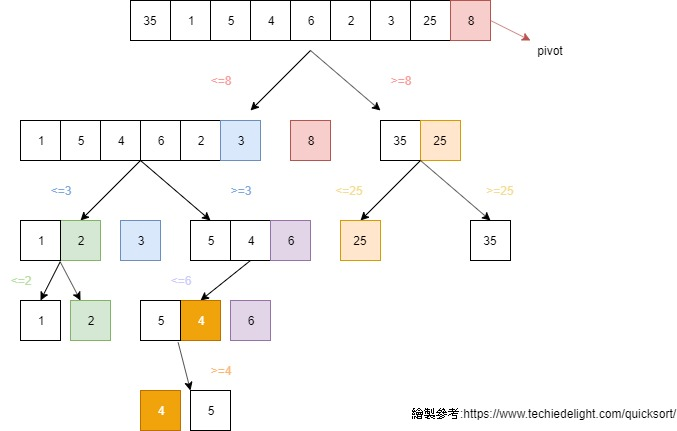
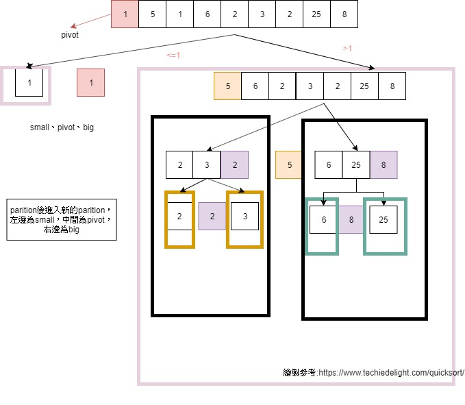
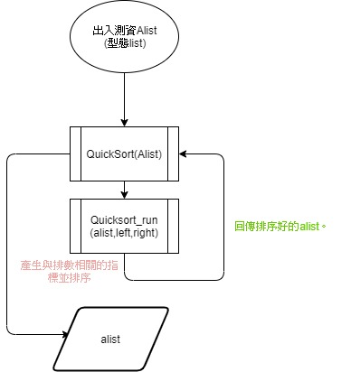

# 簡介:
<!-- TOC START min:1 max:3 link:true asterisk:false update:true -->
- [簡介:](#簡介)
- [小整理:](#小整理)
    - [流程圖](#流程圖)
    - [關於Quick_Sort的時間複雜度:Time Complexities](#關於quick_sort的時間複雜度time-complexities)
- [簡介歷程](#簡介歷程)
- [Quick Sort](#quick-sort)
    - [第一版:](#第一版)
        - [心得:](#心得)
        - [嘗試但錯誤的程式碼:](#嘗試但錯誤的程式碼)
        - [本來的想法：](#本來的想法)
        - [上課後和助教討論:](#上課後和助教討論)
        - [第二個:初步的想法](#第二個初步的想法)
- [參考資料](#參考資料)
<!-- TOC END -->

本次作業為QuickSort 實作。
 `Quick_Sort - 學習歷程助教請看`:主要程式碼的書寫歷程與心得。
 `Quicksort_06170128`:與助教討論後的程式碼檔案。
 其他為留圖原始製作檔與流程圖片

# 小整理:
## 流程圖

## 關於Quick_Sort的時間複雜度:Time Complexities
* 最好的情形:O(Nlog(N))
    * 即使全部都由小到大，最少仍會需要全部跑一次才可以確定
* 平均起來: O(Nlog(N))
* 最壞的情形: O(N^2)
    * 指定到的pivot都為該次排序的最大或最小值。
    * 若都是已經排序好的資料(像是一元樹)。

# 簡介歷程
# Quick Sort

## 第一版:
> 查詢的資料:
http://alrightchiu.github.io/SecondRound/comparison-sort-quick-sortkuai-su-pai-xu-fa.html

>程式碼參考資料資料:
https://ithelp.ithome.com.tw/articles/10202330?sc=iThelpR

整理了這些文章的運作情形。

   > 在輸入的list中隨機指定一個pivot(本次作業pivot為[::-1])，並依據pivot之值，將list分為:
     * 所有元素之值都大於pivot的list_r或皆小於pivot的list_l。list_r、list_l裡面元素暫未排序。
     * 回傳的值:list_r+pivot+list_l
         * 可以試著額外宣告一個list來回傳。
         * 或直接用tuple將元素換位置。
     * 將1ist_l、list_r視為list，重複指定pivot來排序大小，直到分出來的list為null停止。

*  流程圖為參考圖中的網址，改成自己的測資繪製而成。

### 心得:
網路上的資料多為C語言居多，多半使用`swap()`函數來實現將pivot與比較的置換。
在python裡的方式想到的是用`alist[left],alist[l]=alist[l],alist[left]`的方式交換位置。(應該是 `tuple`)
遞迴多半是在function裡呼叫自己，老師上課時提供的程式碼是在第一次分類(> or < pivot)後，更改Quicksort檢驗排序的範圍完成遞迴。

### 嘗試但錯誤的程式碼:
### 本來的想法：
* 因為對於遞迴的概念不熟，所以著重想的是如何重複檢查「和pivot比大小和分類『>pivot』與『<pivot』」的動作?這個動作必需要重複的條件是什麼?
       * 在自己的概念中必須使用while迴圈，for迴圈需要參數的設置可能需要多個以上是自己比較不受的部分(需要再加強)，因此先用while迴圈。並使用老師上課提供的程式碼的遞迴方式。
            * 既然利用while迴圈，那麼停止的條件是?

*  在參考文章中，程式pivot是最尾端的程式碼，而上課資料是quicksort是隨機指定pivot就可以實現，本來想要以import random來試試看，但想先從把pivot改成最開頭的左邊開始。是先寫出過一次可以分成>pivot、<pivot的程式在把它改成def，但一改成def、加上遞迴便會錯。出現的錯誤有:
    * 本來只有設置left、right，而沒有l、r，但這樣子在遞迴的時候left、right都會出現錯誤(因為值一直變)
    * 巢狀迴圈裡面的小while，沒有加上`l!=r`兩個條件就跑不出來。
    * 註解有 % 的地方本來是想要打 `if alist[l]<alist[r]`(直接從值比較)，但出現錯誤。
    * 如果是「單一一個值」、「空的list」的話，無法return出任何資料。=>用Quicksort()加上`if`寫出例外情形。
* 但是，改完後仍出現錯誤:
    * list排序大小是錯的。
    * 本來是將pivot=alist[right]，除了pivot的修改外，和最終IT幫的程式碼不同的地方是註解的%%處兩個while迴圈是對調的。

### 上課後和助教討論:
    不要看網路上的參考資料，用自己的想法與理解直接打成程式碼。
    * 可以將quicksort步驟拆解，如:`PARTITION`獨立成一個function
### 第二個:初步的想法
    所以先把小於指定值的pivot存在一個list，反之亦然。用while包起來，最後把所有list加起來。
    * 不能只用samll或big。
    * 想成遞迴就是對small 和big 再做一次，如果len()值=1才停止，每個框框都是一次的Quciksort。

# 參考資料
> 查詢的資料:
http://alrightchiu.github.io/SecondRound/comparison-sort-quick-sortkuai-su-pai-xu-fa.html

>程式碼參考資料資料:
https://ithelp.ithome.com.tw/articles/10202330?sc=iThelpR
