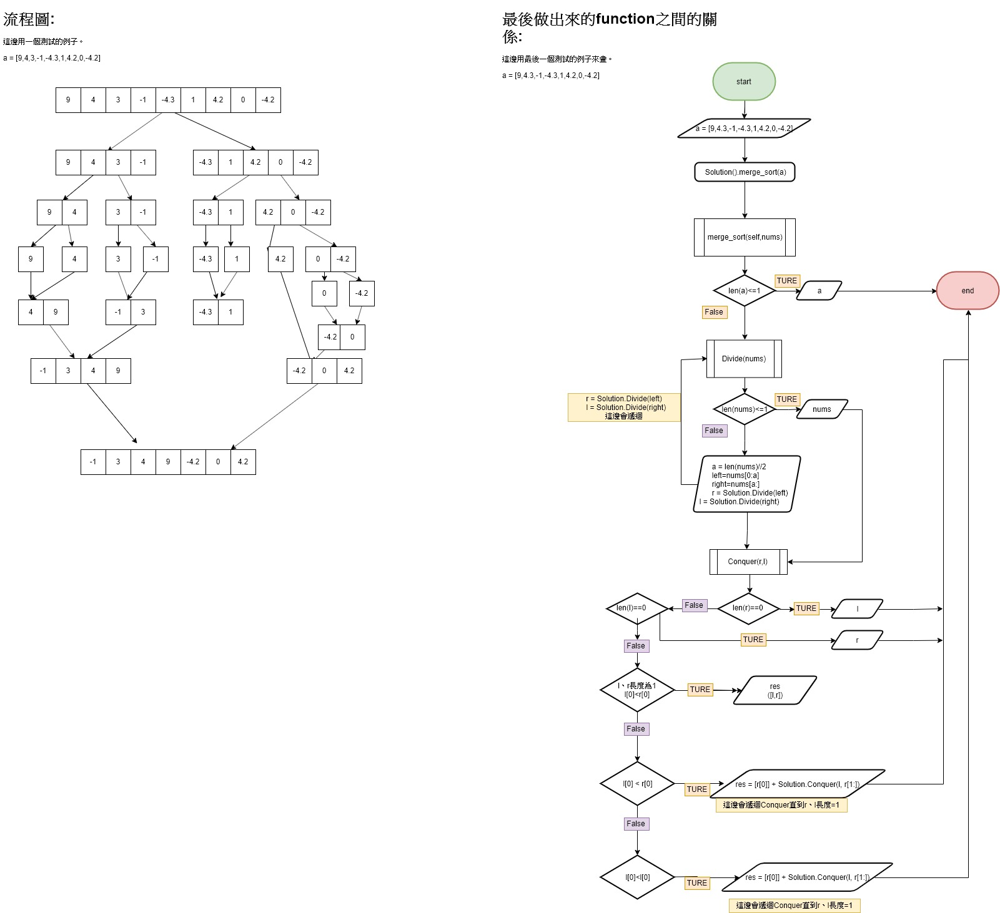
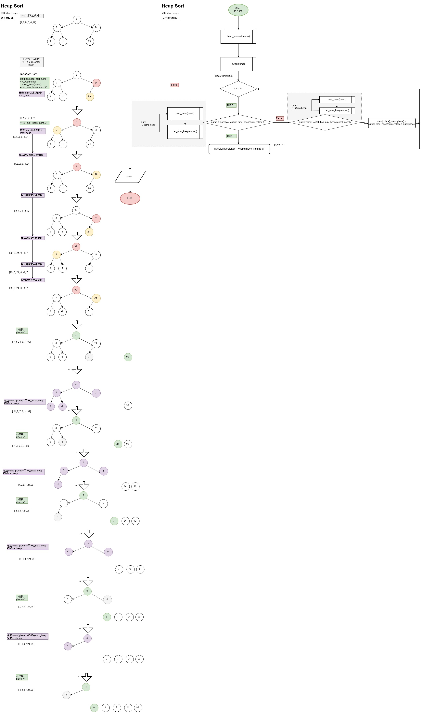

# Hw2
<!-- TOC START min:1 max:3 link:true asterisk:false update:true -->
- [Hw2](#hw2)
- [繳交檔案](#繳交檔案)
- [小整理:](#小整理)
 - [MerageSort](#meragesort)
 - [流程圖:](#流程圖)
 - [關於Heap sort:](#關於heap-sort)
- [最終流程圖](#最終流程圖)
<!-- TOC END -->

# 繳交檔案

* `merge_sort_06170128.py`:最終程式碼檔案
* `heap_sort_06170128.py`:最終程式碼檔案
* ` merge_sort_學習歷程_流程圖_參考資料` 和 `heap_sort_學習歷程_流程圖_參考資料`:
  ipnb檔、md檔的內容相同。
  jpg檔案為流程圖(有排版在檔案裡面)
 因為github上有時候無法顯示inpy，因此加上md檔。😥

* `兩者比較`的 md檔。

# 小整理:
* 複習def

## MerageSort
* 最佳時間複雜度：O(nlog n)
* 平均時間複雜度：O(nlog n)
* 最差時間複雜度：O(nlog n)

Merage Sort是一種用分治法(大問題=>小問題=>解決小問題後就可以解決大問題)。
方法為:
1. `Divide`:把大list拆成小list(拆成len=1)
2. `Conquer`:把小list排序成中list，再把中list排序。
> Merge的大前提：若要由小數列合併出大數列，那麼各自的小數列必須「已經排好序」。

## 流程圖:

## 關於Heap sort:
整理上課與參考資料如下:

* 是一種`Complete Tree`，除了最下面的那一層以外，一定要填滿滿的。會先填左邊的子節點再填右邊的。所以只有最下層的右邊可以有空缺。
* 可以用array來顯示tree。
* 有`Max Heap`和`Min Heap`兩種:
 * Max heap: root一定比葉子大，子樹也是一樣類推下去(父節點>小孩)。
 * Min heap: root一定比葉子小，子樹也是一樣類推下去(父節點<小孩)。
* 試法將冊資形成Max Heap 或 Min Heap。因為只要一旦形成符合Max heap 或 Min heap 的結構。我們就可以移除root，並將最下層最右邊的節點移至root，並再次排成Heap Sort並繼續取出root，如此即可完成排序。其中這種將節點移置root的並再次將結構轉為Heapsort的過程稱為`sift-down`。
# 最終流程圖

參考資料
==
#### Merge Sort
* https://emn178.pixnet.net/blog/post/87965707
* http://alrightchiu.github.io/SecondRound/comparison-sort-merge-sorthe-bing-pai-xu-fa.html
* [合併排序法 - 使用Python(Merge sort)](https://newaurora.pixnet.net/blog/post/224658923-%E5%90%88%E4%BD%B5%E6%8E%92%E5%BA%8F%E6%B3%95---%E4%BD%BF%E7%94%A8python)
* [Merge Sort - 合併排序](https://algorithm.yuanbin.me/zh-tw/basics_sorting/merge_sort.html)
* [初學者學演算法｜排序法進階：合併排序法](https://medium.com/appworks-school/%E5%88%9D%E5%AD%B8%E8%80%85%E5%AD%B8%E6%BC%94%E7%AE%97%E6%B3%95-%E6%8E%92%E5%BA%8F%E6%B3%95%E9%80%B2%E9%9A%8E-%E5%90%88%E4%BD%B5%E6%8E%92%E5%BA%8F%E6%B3%95-6252651c6f7e)
#### 隨機生成list
* https://stackoverflow.com/questions/39379515/how-do-i-generate-a-random-list-in-python-with-duplicates-numbers
* https://stackoverflow.com/questions/3559337/how-to-generate-a-random-list-of-fixed-length-of-values-from-given-range
* [關於Python的類別(Class)...基本篇](https://medium.com/@weilihmen/%E9%97%9C%E6%96%BCpython%E7%9A%84%E9%A1%9E%E5%88%A5-class-%E5%9F%BA%E6%9C%AC%E7%AF%87-5468812c58f2)

##### heap sort(概念複習與學習資源):

* Youtube: [Heap Sort | GeeksforGeeks](https://www.youtube.com/watch?v=MtQL_ll5KhQ)
* Youtube: [Heaps and Heap Sort](https://www.youtube.com/watch?v=H5kAcmGOn4Q)
* [Comparison Sort: Heap Sort(堆積排序法)](http://alrightchiu.github.io/SecondRound/comparison-sort-heap-sortdui-ji-pai-xu-fa.html)
* [堆積排序 Heapsort](https://rust-algo.club/sorting/heapsort/)
* [Heap Sort 的原理及Python實現](https://www.twblogs.net/a/5c7100f9bd9eee68dc3f1be8)
* [維基百科](https://zh.wikipedia.org/wiki/%E5%A0%86%E6%8E%92%E5%BA%8F#Python)
* [GITHUB_PY程式碼](https://github.com/joeyajames/Python/blob/master/MaxHeap.py)

#### 檢查隨意的結果是否已經sort
*  https://www.itread01.com/content/1550354967.html
