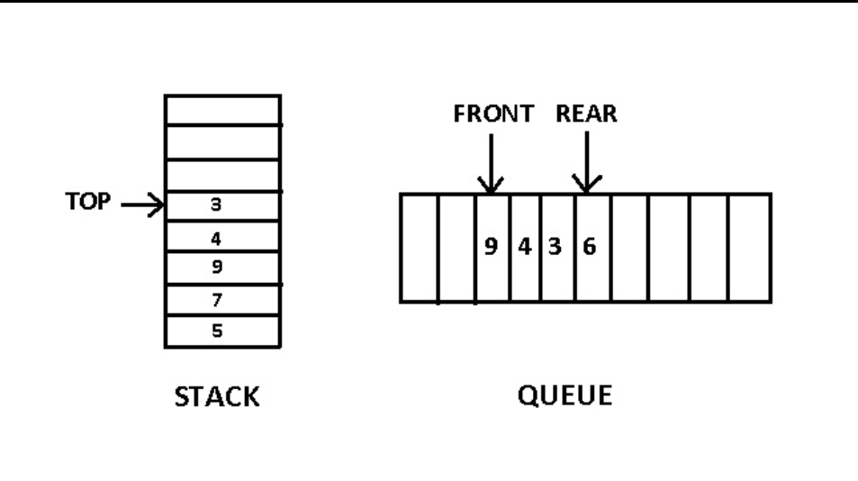
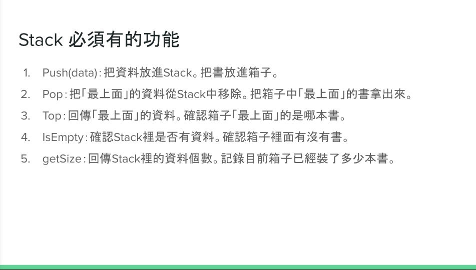

Stack & Queue
===
<!-- TOC START min:1 max:3 link:true asterisk:false update:true -->
- [Stack & Queue示意圖](#stack--queue示意圖)
- [Stack](#stack)
    - [Stack必要功能](#stack必要功能)
    - [設計stack的想法](#設計stack的想法)
    - [實際程式碼](#實際程式碼)
- [Queue](#queue)
    - [Queue必要功能](#queue必要功能)
    - [設計Queue的想法](#設計queue的想法)
    - [實際程式碼](#實際程式碼-1)
- [leetcode刷題](#leetcode刷題)
- [參考與引用資料](#參考與引用資料)
<!-- TOC END -->

# Stack & Queue示意圖

> 圖片來源: [課堂簡報](https://docs.google.com/presentation/d/e/2PACX-1vQ1hb79im0vqpApCttGnXAFRT8SqH9HQP0b_oyVRCV8SVyiHLkHJjidYGAfxkvq468QMumFIDdTeiB-/pub?start=false&loop=false&delayms=3000&slide=id.g5ff860a9a8_0_5)

# Stack

依照圖片，`Stack`是一種*後進先出*的資料結構。
把資料依序丟到stack中，要拿的時候只會從最近丟進去的一個拿出來。
* 許多編輯器(eg:word......等)undo、網頁的「回上一頁」 功能。
都是stack的應用。
* 任何遞迴形式的演算法，都可以用Stack改寫。

### Stack必要功能

> 圖片來源: [課堂簡報](https://docs.google.com/presentation/d/e/2PACX-1vQ1hb79im0vqpApCttGnXAFRT8SqH9HQP0b_oyVRCV8SVyiHLkHJjidYGAfxkvq468QMumFIDdTeiB-/pub?start=false&loop=false&delayms=3000&slide=id.g5ff860a9a8_0_5)

### 設計stack的想法

### 實際程式碼

# Queue

而`Queue`則是*先進先出*的型態。像是排隊時，先到的人先進去餐廳一樣。
類似會計課的FIFO原則。

### Queue必要功能
### 設計Queue的想法
### 實際程式碼

# leetcode刷題
 - [ ]  leetcode|155_Min_Stack
 - [ ]  leetcode|232

# 參考與引用資料
> ["蔡芸琤老師_資料結構與演算法課堂簡報"](https://docs.google.com/presentation/d/e/2PACX-1vQ1hb79im0vqpApCttGnXAFRT8SqH9HQP0b_oyVRCV8SVyiHLkHJjidYGAfxkvq468QMumFIDdTeiB-/pub?start=false&loop=false&delayms=3000&slide=id.p)
